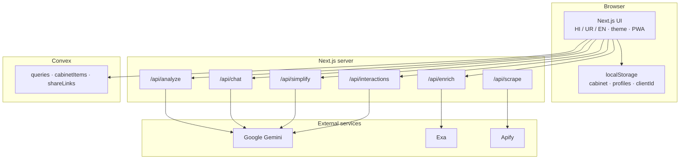

<p align="center">
  
  
  
  
</p>

<p align="center">
  
  
  
  
  
  
</p>

<h1 align="center">Shifa AI</h1>

<p align="center"><strong>Prescription literacy in three languages</strong> — Hindi · Urdu · English · multimodal AI · medicine cabinet · share links · PWA-ready UI.</p>

<p align="center">
  <a href="#executive-summary">Summary</a> ·
  <a href="#features">Features</a> ·
  <a href="#product-screenshots">Screenshots</a> ·
  <a href="#tech-stack">Tech stack</a> ·
  <a href="#api-surface">API</a> ·
  <a href="#convex-backend">Convex</a> ·
  <a href="#getting-started-local">Local setup</a> ·
  <a href="#deployment-vercel">Vercel</a> ·
  <a href="#troubleshooting">Troubleshooting</a>
</p>

---

## Executive summary

**Shifa AI** helps patients and families **read, structure, and understand** medicine names and prescription images. The stack is **Next.js 14** (App Router), **Google Gemini** for text and vision (structured JSON for prescription images with legacy text fallback), optional **Exa** / **Apify**, and **Convex** for live activity, medicine cabinet sync, share links, and impact stats.

The UI uses a **royal healthcare** design system (navy, gold, sage green, cream) with **Cormorant Garamond** + **Source Sans 3**, plus script fonts for Urdu and Hindi. Light/dark themes and a **PWA** manifest are included.

**Disclaimer:** Informational and educational only — **not** a substitute for a licensed clinician.

---

## Features

| Area | What users get |
|------|----------------|
| **Core** | Type a medicine name or upload a prescription photo; results in Hindi, Urdu (RTL), or English |
| **Structured Rx** | Gemini JSON extraction → bilingual medication rows, safety notes, dashboard view |
| **Legacy fallback** | Free-text parsing + offline JSON for common drugs when AI is unavailable |
| **Medicine cabinet** | Save meds per family profile; pharmacy checklist (Convex sync, or `localStorage` without Convex) |
| **Rx tools** | Daily schedule timeline, interaction hints, compare two prescriptions, camera coach |
| **Explain & listen** | “Explain simply” (Gemini), read-aloud (Web Speech API), print/PDF-style export |
| **Rx chat** | Scoped follow-up Q&A on the current prescription context |
| **Share** | Time-limited share links (`/share/[token]`) via Convex |
| **Activity** | Live recent queries; impact counter on the welcome screen |
| **PWA** | `manifest.json` + service worker (production only; dev unregisters SW to avoid stale chunks) |

**Not in scope:** user accounts, HIPAA guarantees, or clinical decision support — see [Safety & compliance](#safety--compliance).

---

## Product screenshots

Representative UI captures. Replace with fresh PNGs from `npm run dev` if needed — see [`docs/screenshots/README.md`](docs/screenshots/README.md).

<p align="center">
  
  &nbsp;
  
  &nbsp;
  
</p>

<p align="center"><em>Left: welcome · Center: assistant workspace · Right: structured prescription analysis</em></p>

---

## Tech stack

| Layer | Technology | Role |
|------|------------|------|
| **Framework** | Next.js 14 (App Router), React 18, TypeScript | Pages, API routes, client components |
| **Styling** | Tailwind CSS 3, CSS variables (`globals.css`) | Royal healthcare tokens, light/dark theme |
| **Typography** | Cormorant Garamond, Source Sans 3, Noto Nastaliq / Noto Devanagari | Display, UI, Urdu, Hindi |
| **Motion** | `motion` | Transitions on prescription dashboard |
| **UI** | Radix Slot, CVA, `clsx`, `tailwind-merge`, Lucide | Buttons, cards, icons |
| **AI** | `@google/generative-ai` (Gemini 2.5 Flash) | Analyze, simplify, chat, interactions |
| **Search / automation** | `exa-js`, `apify-client` | Optional `/api/enrich`, `/api/scrape` |
| **Realtime data** | Convex | Queries, cabinet, share links, impact stats |
| **Rate limiting** | `@upstash/ratelimit` + Redis (optional) + in-memory fallback | All inference POST routes |
| **Testing** | Vitest | Fallback medicines, i18n, rate limit |
| **Deploy** | Vercel, Docker (`output: "standalone"`) | Production hosting |

### Architecture (high level)



---

## API surface

All inference routes call **`enforceApiRateLimit`** first (429 + `{ code: "RATE_LIMITED" }` when exceeded).

| Route | Method | Body (summary) | Purpose |
|-------|--------|----------------|---------|
| `/api/analyze` | POST | `{ text?, image?, lang? }` — `lang`: `ur` \| `en` \| `hi` | Medicine Q&A and/or prescription image |
| `/api/enrich` | POST | `{ medicineName }` | Exa-backed source snippets |
| `/api/scrape` | POST | `{ medicineName }` | Optional Apify CDSCO scrape |
| `/api/chat` | POST | `{ message, contextSummary, lang? }` | Scoped Rx follow-up chat |
| `/api/simplify` | POST | `{ text, lang? }` | Plain-language rewrite |
| `/api/interactions` | POST | `{ medications[], lang? }` | Interaction hints (needs ≥2 meds) |

**Pages:** `/` (main app), `/share/[token]` (read-only shared summary).

---

## Convex backend

### Tables

| Table | Purpose |
|-------|---------|
| `queries` | Recent medicine / Rx searches (`saveQuery`, `getRecentQueries`) |
| `cabinetItems` | Per-client, per-profile medicine cabinet |
| `shareLinks` | Tokenized share payloads with expiry |

### Functions (public)

| Module | Names |
|--------|--------|
| **queries** | `getRecentQueries`, `getCabinetItems`, `getShareByToken`, `getImpactStats` |
| **mutations** | `saveQuery`, `saveCabinetItem`, `removeCabinetItem`, `toggleCabinetPurchased`, `createShareLink` |

Without `NEXT_PUBLIC_CONVEX_URL`, the app still runs: cabinet uses **localStorage**, share/impact/recent queries are degraded or hidden.

### Dev vs production deployments

| Command | Target | When to use |
|---------|--------|-------------|
| `npx convex dev` | **Dev** deployment (`CONVEX_DEPLOYMENT` in `.env.local`) | Local development — watches and pushes Convex code |
| `npx convex dev --once` | Dev deployment | One-shot push after pulling Convex changes |
| `npx convex deploy` | **Production** deployment | Vercel / production URL |

**Important:** `NEXT_PUBLIC_CONVEX_URL` must match the deployment you pushed to. If you see `Could not find public function for 'queries:getImpactStats'`, run `npx convex dev --once` (or keep `npx convex dev` running) against the same deployment URL in `.env.local`.

---

## Verification (repo health)

| Check | Command |
|-------|---------|
| Lint | `npm run lint` |
| Unit tests | `npm run test` |
| Full CI | `npm run ci` (lint → test → build) |
| Production build | `npm run build` |

CI runs on push/PR to `main` / `master` via [`.github/workflows/ci.yml`](.github/workflows/ci.yml).

### Feature checks (need valid env)

| Feature | Required env |
|---------|----------------|
| Medicine + image analysis | `GEMINI_API_KEY` |
| Live recent queries, cabinet sync, share links, impact stats | `NEXT_PUBLIC_CONVEX_URL` + Convex pushed (`npx convex dev` or `deploy`) |
| Source enrichment | `EXA_API_KEY` (optional) |
| CDSCO scrape API | `APIFY_API_TOKEN` (optional) |
| Distributed rate limits (Vercel) | `UPSTASH_REDIS_REST_URL`, `UPSTASH_REDIS_REST_TOKEN` |

---

## Getting started (local)

### 1) Install

```bash
npm install
```

### 2) Environment

```bash
copy .env.example .env.local
```

On macOS/Linux: `cp .env.example .env.local`

```env
GEMINI_API_KEY=
EXA_API_KEY=
APIFY_API_TOKEN=
NEXT_PUBLIC_CONVEX_URL=

# Written by `npx convex dev` — dev deployment name, e.g. dev:your-deployment-name
# CONVEX_DEPLOYMENT=dev:...

# Optional — recommended for production rate limits
# UPSTASH_REDIS_REST_URL=
# UPSTASH_REDIS_REST_TOKEN=
```

### 3) Convex (recommended)

Use **two terminals**:

```bash
# Terminal 1 — sync Convex functions to your dev deployment
npx convex dev
```

```bash
# Terminal 2 — Next.js
npm run dev
```

After schema or function changes, if you are not running `convex dev` continuously:

```bash
npx convex dev --once --env-file .env.local
```

### 4) Open the app

**http://localhost:3000**

### Scripts

| Script | Description |
|--------|-------------|
| `npm run dev` | Development server |
| `npm run dev:clean` | Delete `.next`, then dev (helps Windows / OneDrive cache issues) |
| `npm run clean` | Delete `.next` only |
| `npm run build` | Production build |
| `npm run build:clean` | Clean + build |
| `npm run start` | Production server (**after** `npm run build`) |
| `npm run lint` | ESLint |
| `npm run test` | Vitest |
| `npm run test:watch` | Vitest watch |
| `npm run ci` | Lint + test + build |

---

## Deployment (Vercel)

1. Import the repo in [Vercel](https://vercel.com). Framework: **Next.js**. Build: `npm run build`.
2. Set environment variables (Production and Preview as needed):

   | Variable | Required | Notes |
   |----------|----------|--------|
   | `GEMINI_API_KEY` | Yes for AI | Google AI Studio |
   | `NEXT_PUBLIC_CONVEX_URL` | For Convex features | **Production** URL from `npx convex deploy` |
   | `EXA_API_KEY` | No | `/api/enrich` |
   | `APIFY_API_TOKEN` | No | `/api/scrape` |
   | `UPSTASH_REDIS_REST_URL` / `UPSTASH_REDIS_REST_TOKEN` | Recommended | See [`docs/PRODUCTION.md`](docs/PRODUCTION.md) |

3. Deploy Convex to production, then paste that URL into `NEXT_PUBLIC_CONVEX_URL`:

   ```bash
   npx convex deploy
   ```

4. Smoke test: text query, prescription image, cabinet save, share link (if Convex is set).

---

## Docker

Multi-stage **Dockerfile** with Next **`output: "standalone"`**. `NEXT_PUBLIC_CONVEX_URL` must be available at **build time** if the client bundle needs Convex.

```bash
docker compose up --build
```

App listens on **port 3000**.

---

## Troubleshooting

| Symptom | Fix |
|---------|-----|
| `Could not find public function for 'queries:…'` | Run `npx convex dev --once` (or `npx convex dev`); ensure `NEXT_PUBLIC_CONVEX_URL` matches that deployment |
| 404 on `/_next/static/*` or broken styles in dev | Hard refresh (Ctrl+Shift+R); run `npm run dev:clean`; unregister old service workers (PWA SW is disabled in dev) |
| `npm start` shows missing chunks | Run `npm run build` first — `start` serves a production build, not dev |
| Stale `.next` on synced folders (OneDrive) | `npm run clean` or `npm run dev:clean` |
| Convex works locally but not on Vercel | Production URL must come from `npx convex deploy`, not the dev deployment |

---

## Production operations & hardening

**Rate limiting** applies to: `analyze`, `enrich`, `scrape`, `chat`, `simplify`, `interactions`. With Upstash Redis, limits are distributed across Vercel isolates; otherwise an in-process limiter helps single-process runs only.

Security headers are set in `next.config.mjs`. For runbooks, tuning, and compliance notes, see **[`docs/PRODUCTION.md`](docs/PRODUCTION.md)**.

---

## Quality assurance

Vitest covers **deterministic** logic: fallback medicines, i18n helpers, rate limiting. Gemini output is **not** unit-tested — smoke-test text and image flows manually after deploy.

---

## Safety & compliance

- Shifa AI provides **educational information**, not diagnosis or prescribing.
- Always confirm care decisions with a **qualified clinician**.
- Images are sent to **Google Gemini** when analyzed; define retention and privacy policies for production.
- No authentication or HIPAA claims in this repository.

---

## Repository hygiene

- Do **not** commit `.env`, `.env.local`, or API keys.
- Rotate any key that was exposed.
- Agent-oriented file map and API behavior: **[`docs/PROJECT_REFERENCE.md`](docs/PROJECT_REFERENCE.md)** (update alongside major features).

---

## License & contact

**Shifa AI** — clearer prescriptions in **Hindi**, **Urdu**, and **English**.

---

<p align="center">
  <sub>Badges: <a href="https://shields.io">Shields.io</a> · Maintainer reference: <code>docs/PROJECT_REFERENCE.md</code></sub>
</p>
