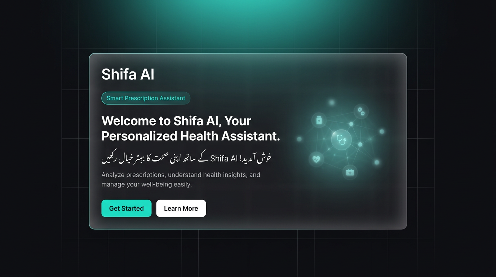
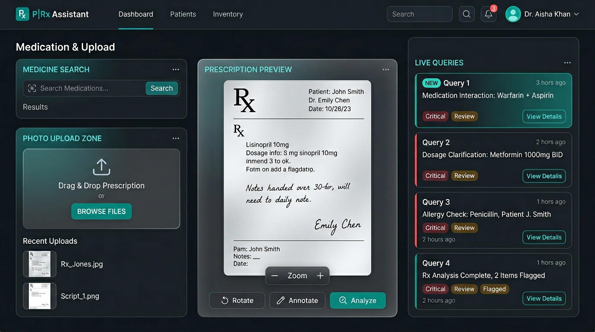
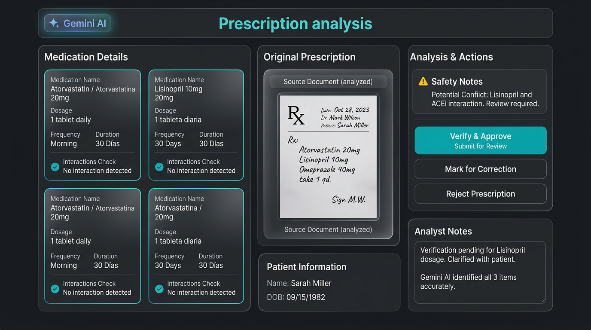
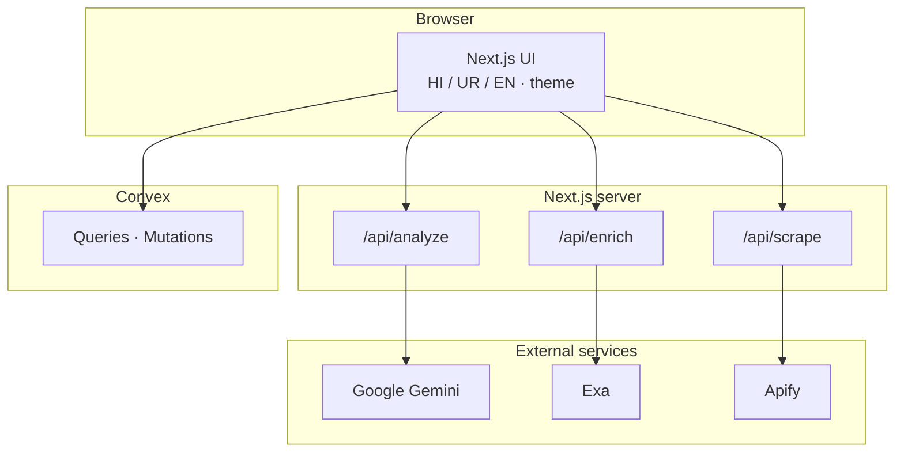

<p align="center">
  
  
  
  
</p>

<p align="center">
  
  
  
  
  
  
</p>

<h1 align="center">Shifa AI</h1>

<p align="center"><strong>Prescription literacy in three languages</strong> — Hindi · Urdu · English · multimodal AI · real-time activity · production-ready UI.</p>

<p align="center">
  <a href="#problem-statement">Problem</a> ·
  <a href="#our-solution">Solution</a> ·
  <a href="#product-screenshots">Screenshots</a> ·
  <a href="#tech-stack">Tech stack</a> ·
  <a href="#deployment-vercel">Vercel</a> ·
  <a href="#getting-started-local">Local setup</a> ·
  <a href="#docker">Docker</a>
</p>

---

## Executive summary

**Shifa AI** helps patients and families **read, structure, and understand** medicine names and prescription images. The app combines a **Next.js 14** frontend (App Router), **API routes** for analysis and optional enrichment, **Google Gemini** for text and vision (including structured JSON for prescription images), optional **Exa** and **Apify**, and **Convex** for live recent queries. It ships with **Docker** (`output: "standalone"`) and deploys cleanly to **Vercel**.

**Disclaimer:** Informational and educational only — **not** a substitute for a licensed clinician.

---

## Problem statement

| Challenge | Why it matters |
|-----------|----------------|
| **Illegible or mixed scripts** | Handwritten prescriptions and mixed Hindi/Urdu/English are hard to parse quickly. |
| **Brand vs generic names** | The same drug appears under many names; families need plain-language context. |
| **Dose, timing, food, warnings** | Instructions are dense; mistakes are common without a structured, calm explanation. |
| **Language barriers** | Not everyone reads English-first medical labels; tri-lingual UI reduces friction. |

Shifa AI narrows the **understanding gap** with structured output, a clear workspace, and transparent limits — while keeping **treatment decisions** with healthcare professionals.

---

## Our solution

1. **Type a medicine** or **upload a prescription photo** — Gemini analyzes text or image (structured extraction for images when the JSON path succeeds; legacy text fallback otherwise).  
2. **Choose language** — Hindi, Urdu (RTL), or English; UI and AI prompts follow the selection.  
3. **See results** in cards (dosage, timing, food, warnings) with optional **Exa** source enrichment.  
4. **Recent activity** powered by **Convex** — searches appear live without a full page reload.  
5. **Fallback medicines** — offline JSON fallback when the API is unreachable (common drugs).

---

## Product screenshots

Representative UI captures in the Shifa visual language (dark theme, teal accents). Replace with your own PNGs from `npm run dev` if you need pixel-perfect marketing assets — see [`docs/screenshots/README.md`](docs/screenshots/README.md).

<p align="center">
  
  &nbsp;
  
  &nbsp;
  
</p>

<p align="center"><em>Left: welcome · Center: assistant workspace · Right: structured prescription analysis</em></p>

---

## Tech stack

| Layer | Technology | Role |
|------|------------|------|
| **Framework** | Next.js 14 (App Router), React 18, TypeScript | Pages, layouts, client components, route handlers |
| **Styling** | Tailwind CSS 3, CSS variables, Motion (`motion`) | Responsive UI, dark/light theme, subtle motion |
| **UI primitives** | Radix Slot, CVA, `clsx`, `tailwind-merge` | Composable components |
| **Icons** | Lucide React | Icons |
| **AI** | `@google/generative-ai` (Gemini 2.5 Flash) | Medicine Q&A, vision, structured prescription JSON |
| **Search / automation** | `exa-js`, `apify-client` | Optional enrichment (`/api/enrich`) and scraping (`/api/scrape`) |
| **Realtime data** | Convex | `queries` table, `saveQuery` / `getRecentQueries` |
| **Runtime** | Node.js | API routes; Docker uses Next **standalone** output |

### Architecture (high level)



---

## API surface

| Route | Method | Purpose |
|-------|--------|---------|
| `/api/analyze` | POST | Medicine text and/or prescription image (`lang`: `ur` \| `en` \| `hi`) |
| `/api/enrich` | POST | Optional Exa-backed source snippets |
| `/api/scrape` | POST | Optional Apify scraping |

---

## Verification (repo health)

| Check | Command / note |
|-------|----------------|
| Lint | `npm run lint` — ESLint `next/core-web-vitals` |
| Production build | `npm run build` — typecheck + static analysis |

**Feature checks (need valid env):**

| Feature | Required env |
|---------|----------------|
| Medicine + image analysis | `GEMINI_API_KEY` |
| Live recent queries | `NEXT_PUBLIC_CONVEX_URL` + Convex deployed |
| Enrichment | `EXA_API_KEY` (optional) |
| Scraping | `APIFY_API_TOKEN` (optional) |

If you see **missing chunk** errors (e.g. `./682.js`), run `npm run clean` then `npm run dev` or `npm run dev:clean` — stale `.next` on synced folders (e.g. OneDrive) can cause this.

---

## Deployment (Vercel)

1. **Push** this repo to GitHub/GitLab/Bitbucket and **import** the project in [Vercel](https://vercel.com).  
2. **Framework:** Next.js (auto-detected). **Build:** `npm run build`. **Output:** default (Vercel runs Next natively; `standalone` in `next.config.mjs` mainly helps **Docker**).  
3. **Environment variables** (Project → Settings → Environment Variables), for **Production** (and Preview if you test PRs):

   | Variable | Required | Notes |
   |----------|----------|--------|
   | `GEMINI_API_KEY` | Yes for AI | Google AI Studio / Vertex as applicable |
   | `NEXT_PUBLIC_CONVEX_URL` | Yes for live queries | From `npx convex deploy` production deployment |
   | `EXA_API_KEY` | No | Only if you use `/api/enrich` |
   | `APIFY_API_TOKEN` | No | Only if you use `/api/scrape` |

4. **Convex:** Deploy backend once: `npx convex deploy`, then paste the **production** deployment URL into `NEXT_PUBLIC_CONVEX_URL`.  
5. **Smoke test** after deploy: open the site, run a **text** medicine query and (if possible) a **prescription image**; confirm recent queries update if Convex is set.

**Not required on Vercel:** Docker — that path is optional for self-hosted or container platforms.

---

## Getting started (local)

### 1) Install

```bash
npm install
```

### 2) Environment

```bash
copy .env.example .env.local
```

On macOS/Linux: `cp .env.example .env.local`

```env
GEMINI_API_KEY=
EXA_API_KEY=
APIFY_API_TOKEN=
NEXT_PUBLIC_CONVEX_URL=
```

### 3) Convex (live queries)

```bash
npx convex dev
```

### 4) Run

```bash
npm run dev
```

Open **http://localhost:3000**.

### Scripts

| Script | Description |
|--------|-------------|
| `npm run dev` | Development server |
| `npm run dev:clean` | Remove `.next` then dev |
| `npm run clean` | Delete `.next` |
| `npm run build` | Production build |
| `npm run build:clean` | Clean + build |
| `npm run start` | Production server (after `build`) |
| `npm run lint` | ESLint |

---

## Docker

Multi-stage **Dockerfile** with Next **`output: "standalone"`**. For Docker builds, `NEXT_PUBLIC_CONVEX_URL` must be available at **build time** if the client bundle needs it.

```bash
docker compose up --build
```

App listens on **port 3000**.

---

## Safety & compliance

- Shifa AI provides **educational information**, not diagnosis or prescribing.  
- Always confirm care decisions with a **qualified clinician**.  
- For production, define **retention**, **encryption**, and **access control** for prescription images and logs.

---

## Repository hygiene

- Do **not** commit `.env`, `.env.local`, or API keys.  
- Rotate any key that was exposed.  
- See **[`docs/PROJECT_REFERENCE.md`](docs/PROJECT_REFERENCE.md)** for a full file map and API behavior.

---

## License & contact

**Shifa AI** — clearer prescriptions in **Hindi**, **Urdu**, and **English**.

---

<p align="center">
  <sub>Badges: <a href="https://shields.io">Shields.io</a> · Detailed agent-oriented reference: <code>docs/PROJECT_REFERENCE.md</code></sub>
</p>
