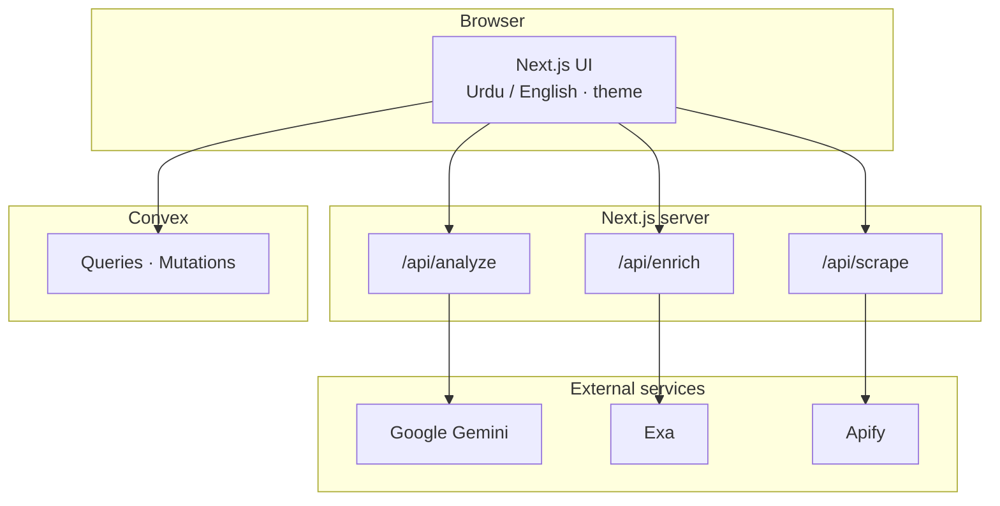

<p align="center">
  
  
  
  
</p>

<p align="center">
  
  
  
  
  
</p>

<h1 align="center">Shifa AI</h1>

<p align="center"><strong>Bilingual prescription literacy</strong> — Urdu & English · multimodal AI · real-time activity · production-ready UI.</p>

<p align="center">
  <a href="#product-previews">Previews</a> ·
  <a href="#full-stack--architecture">Architecture</a> ·
  <a href="#verification">Verification</a> ·
  <a href="#getting-started-local">Setup</a> ·
  <a href="#docker">Docker</a>
</p>

---

## Executive summary

**Shifa AI** helps patients and families **read, structure, and understand** medicine names and prescription images. The product combines a **Next.js 14** frontend, **serverless API routes**, **Google Gemini** for text and vision, optional **Exa** enrichment and **Apify** scraping, and **Convex** for live “recent activity” — packaged for **Docker** with `standalone` output.

Informational only — **not** a substitute for a licensed clinician.

---

## Problem statement

Prescriptions mix **handwriting**, **brand vs generic names**, and **multiple languages**. Instructions for dose, timing, food, and warnings are easy to misread. Shifa AI reduces that **understanding gap** with structured, bilingual output and a calm, accessible interface — while keeping **treatment decisions** with healthcare professionals.

---

## Product previews

<p align="center">
  
  
  
</p>

<p align="center"><em>Placeholder wireframes — replace these files in <code>docs/screenshots/</code> with real PNG/WebP exports from your running app for marketing and docs.</em></p>

---

## Full stack & architecture

### Stack at a glance

<p align="center">
  
</p>

| Layer | Technology | Role |
|------|------------|------|
| **UI** | Next.js 14 (App Router), React 18, TypeScript | Routes, layouts, client components, API routes |
| **Styling** | Tailwind CSS 3, CSS variables, `motion` | Responsive “medical glass” UI, motion |
| **Components** | Radix UI (`@radix-ui/react-slot`), CVA, `clsx`, `tailwind-merge` | Accessible primitives, composable styles |
| **Icons** | Lucide React | Consistent iconography |
| **AI** | `@google/generative-ai` (Gemini) | Medicine Q&A, prescription image → structured JSON or legacy text |
| **Search / data** | `exa-js`, `apify-client` | Optional enrichment and scraping |
| **Realtime data** | Convex | Schema, queries, mutations, live recent queries |
| **Runtime** | Node.js | Next server, API routes, Docker `standalone` |

### System diagram



---

## API surface

| Route | Method | Purpose |
|-------|--------|---------|
| `/api/analyze` | POST | Text medicine lookup and/or prescription image analysis (structured JSON for images when supported; legacy text fallback) |
| `/api/enrich` | POST | Optional source enrichment (Exa) |
| `/api/scrape` | POST | Optional scraping (Apify) |

---

## Verification

| Check | Status |
|-------|--------|
| `npm run build` | Production bundle and typecheck |
| `npm run lint` | ESLint (`next/core-web-vitals`) |

**Manual checks (require valid `.env.local`):**

| Feature | Needs |
|---------|--------|
| Medicine search | `GEMINI_API_KEY` |
| Prescription photo (structured) | `GEMINI_API_KEY` |
| Recent queries (live) | `NEXT_PUBLIC_CONVEX_URL` + `npx convex dev` |
| Enrichment | `EXA_API_KEY` |
| Scraping | `APIFY_API_TOKEN` |

If the dev server shows a **missing chunk** error (e.g. `Cannot find module './682.js'`), stop the server, run `npm run clean`, then `npm run dev` or `npm run dev:clean`. Avoid mixing stale `.next` artifacts (common on synced folders such as OneDrive).

---

## Getting started (local)

### 1) Install

```bash
npm install
```

### 2) Environment

```bash
copy .env.example .env.local
```

On macOS/Linux: `cp .env.example .env.local`

```env
GEMINI_API_KEY=
EXA_API_KEY=
APIFY_API_TOKEN=
NEXT_PUBLIC_CONVEX_URL=
```

### 3) Convex (for live queries)

```bash
npx convex dev
```

### 4) Run

```bash
npm run dev
```

Open **http://localhost:3000**.

### Useful scripts

| Script | Description |
|--------|-------------|
| `npm run dev` | Development server |
| `npm run dev:clean` | Delete `.next` then dev (fixes stale cache) |
| `npm run clean` | Remove `.next` only |
| `npm run build` | Production build |
| `npm run build:clean` | Clean + production build |
| `npm run start` | Run production server (after `build`) |
| `npm run lint` | ESLint |

---

## Docker

Multi-stage **Dockerfile** with Next **`output: "standalone"`**. `NEXT_PUBLIC_CONVEX_URL` must be available at **image build time** for client bundles.

**Compose (recommended):** put keys in a root `.env`, then:

```bash
docker compose up --build
```

App listens on **port 3000**.

---

## Safety & compliance

- Shifa AI provides **educational information**, not diagnosis or prescribing.
- Always confirm care decisions with a **qualified clinician**.
- For production, define **retention**, **encryption**, and **access control** for prescription images and logs.

---

## Deployment (typical)

1. Build the Next.js app (container or Node host).
2. Set the same environment variables as local production.
3. Point `NEXT_PUBLIC_CONVEX_URL` to a **production** Convex deployment.
4. Run smoke tests on `/api/analyze` (text + image) before go-live.

---

## Repository hygiene

- Never commit `.env`, `.env.local`, or API keys.
- Rotate any key that was exposed.

---

## License & contact

Project: **Shifa AI** — prescription clarity in **Urdu** and **English**.

---

<p align="center">
  <sub>Stack badges use <a href="https://shields.io">Shields.io</a> · Icon strip via <a href="https://skillicons.dev">skillicons.dev</a> · Replace <code>docs/screenshots/*.svg</code> with real product screenshots for your README and landing page.</sub>
</p>
